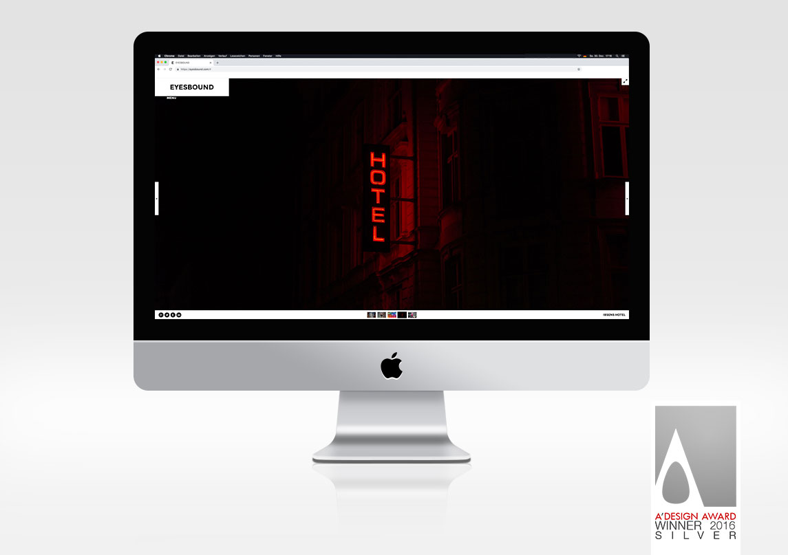

# Eyesbound
[](https://github.com/xojs/xo)
[](https://web.dev/performance-scoring/)
[](https://developers.google.com/web/fundamentals/accessibility)

[](https://developers.google.com/search/docs/advanced/guidelines/webmaster-guidelines)
[](https://web.dev/pwa-checklist/)


## Development

Create a `.env.development` file with the following content:

```dotenv
GATSBY_API_KEY=Permanent Accesstoken from https://eyesbound.prismic.io/settings/apps/
GATSBY_G_MAPS=localhost key from https://console.cloud.google.com/apis/credentials?project=valiant-broker-141207
```

Then run

```shell script
npm start
```

You can now view eyesbound in the browser.

```
http://localhost:8000/
```

View GraphiQL, an in-browser IDE, to explore your site's data and schema

```⠀
http://localhost:8000/___graphql
```

Copy the json from each custom type (e.g. `https://eyesbound.prismic.io/masks/category.json/`) to `src/schemas`.<br>
For better code-completion in Webstorm go to GraphQL tab and click on "Get GraphQL Schema from Endpoint"<br>
This will update the `schema.graphql` file and offer better code completion when working with queries.<br>

`gatsby-node.js` allows for generating routes / pages based on queries. Use the templates in `src/templates` for generation.

Furthermore, reusable components are stored in `src/components` in an atomic design structure.

## Structure
```
src
├───components      All HTML components go here
│   ├───atoms       All tiny / non dividable components
│   │   └───icons   SVG icons that need to be rendered as <svg> (not as image)
│   ├───molecules   All medium complex components
│   └───organisms   All complex and high order components
├───constants       Constants (You don't say!)
├───pages           Single static pages
├───schemas         GraphQL definitions and schemas
├───styles          emotion CSS in JS files (normal .css files live in /static)
├───templates       Top level templates that get rendered via Gatsby using GraphQL
├───types           TS style proptypes
└───utils           Often used helper functions
```
